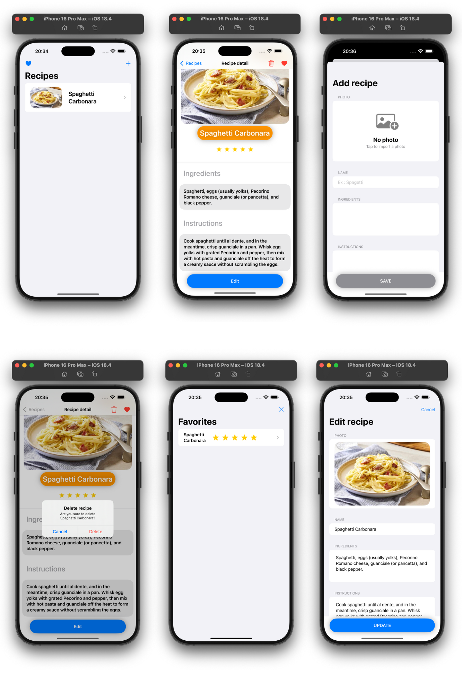

# Recipe Manager App 🍽️

A beginner-friendly iOS app to **store, manage, rate, and favorite recipes**. Built using **SwiftUI** and **SwiftData** as part of my iOS development journey.

---

## ✨ Features

- 📝 Add Recipes – Create recipes with name, ingredients, instructions, rating and a photo
- 🖼️ Save Images – Store and persist photos locally using SwiftData  
- ❤️ Favorites – Mark/unmark recipes with a heart icon  
- ⭐ Star Rating – Rate recipes from 1 to 5 stars  
- 🗑️ Delete Recipes – Confirmation alert before deleting  
- 🏪 App Review Prompt – Uses `StoreKit` to request in-app review  
- 🔒 Disabled Buttons – Prevent saving with empty fields  

---

## 🛠️ Technologies

- **SwiftUI** – Declarative UI framework  
- **SwiftData** – Local data persistence
- **PhotosUI** – Image picker integration
- **StoreKit** – In-app review

---

 ## ✅ Requirements

- Xcode 16+  
- iOS 18+
- Swift 6+

---

## 📸 Screenshots

